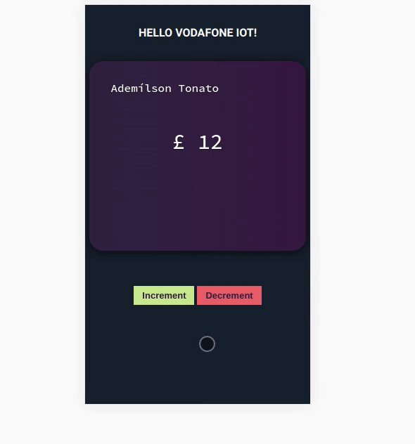

# Vodafone IoT Portal Dev Test

Vodafone IoT Portal Dev Test.

## Demonstration

[Click to check this project running on codesandbox](https://codesandbox.io/embed/github/ftonato/vodafone-iot/)

## Full Process

1. The first step was to re-read the challenge because on the first view it looked so "over-engineering"...
2. I read some materials (see the attachments section below) to understand how to use _redux-saga_;
3. On this moment, I decided to add some things that I like, so I came with _styled-components_ <3
4. I installed 99% of the packages that I thought would be used;
5. I went to browse on _dribbble_ to get some inspiration, and did this search (https://dribbble.com/search/credit%20card);
6. After drawing everything, I forgot that I had installed _styled-components_ and quickly rewrote everything using it;
7. When the layout was ready, I thought it was time to go to the request. This part was not easy, because that was when I had to use the _redux-saga_ for the first time.
8. That done after a while; I decided that the _UI_ needed to be updated with a _Loading_, so I navigated to *Sam Herbert's* website and found an SVG loading.
9. I created in the store the control part for Loading to become visible and it was at this point that I decided to use _React Reveal_ to create some animations.
10. At this moment, it's 00:35 and I need to create the tests, but I'm tired now and I still don't know where to start (I will come soon to continue writing here).
11. I had forgot to mention that I don't think that is necessary to add a new pre-processor for CSS, then I'm using the _CSS Comb_ to format my styles.
12. I went to the _codesandbox_ to update my project;
13. Notes about units tests on [NOTES.md](NOTES.md).

### Attachments

- https://redux-saga.js.org/docs/introduction/BeginnerTutorial.html
- https://www.npmjs.com/package/redux-saga-requests
- https://hackernoon.com/moving-api-requests-to-redux-saga-21780f49cbc8
- https://engineering.universe.com/what-is-redux-saga-c1252fc2f4d1
- https://styled-components.com/docs
- https://samherbert.net/svg-loaders/
- https://www.react-reveal.com/
- http://whatthecommit.com/ (just for fun)
- https://csscomb.herokuapp.com/online
- https://codesandbox.io

### Credits
- Documentations
- SVG Icon - By Sam Herbert (@sherb), for everyone. More @ http://goo.gl/7AJzbL
- StackOverflow

## License
[MIT](LICENSE)